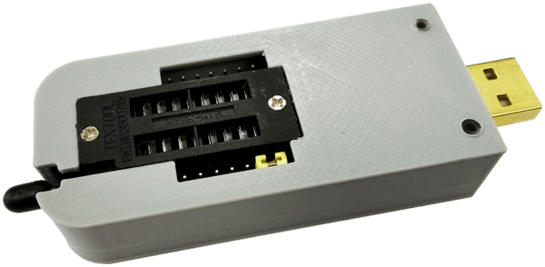
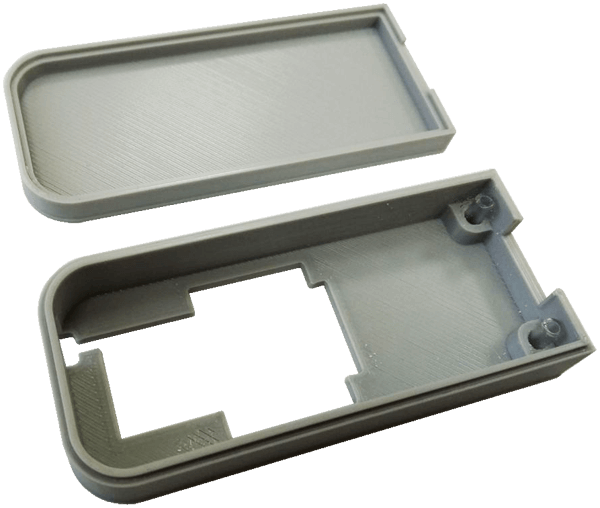
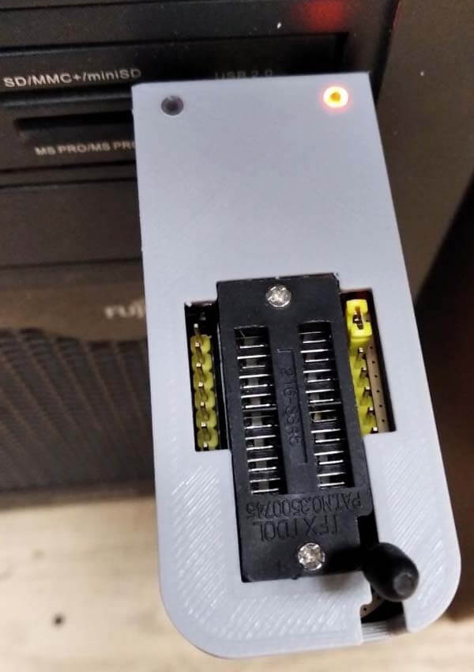
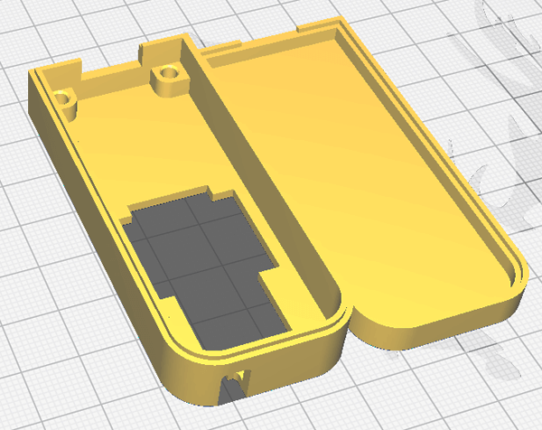

# Tools_for_CH341A_programmer

Homemade and factory tools for the CH341A programmer device.

## 3D-Printed housing for the programmer device

The *FreeCad* files can be downloaded [here](3d_printing/CH341_black_up2.FCStd) (top half) and [here](3d_printing/CH341_black_down2.FCStd) (bottom half).

The *STL* files for the slicer can be downloaded [here](3d_printing/CH341_black_up2-Body.stl) (top half) and [here](3d_printing/CH341_black_down-Body.stl) (bottom half).

Two 9 mm long sections of used empty pen rod are used as light conducting elements for the SMD LEDs.

## Homemade Chip adapters

# The 93Cxx DIP adapter

This adapter is used for 93C46, 93C56, 93C66, 93C76, 93C86 chips. It must be inserted into slot #25xxx# CH341 programmer device. 
The schematic of this adapter is:
<svg width="300" height="220" viewBox="0 0 300 220" version="1.1" xmlns="http://www.w3.org/2000/svg">
<path d="M10,10h120v180h-120v-180m160 0h120v180h-120v-180" stroke="#999" fill="#bbb" stroke-width="2" stroke-linejoin="round" stroke-linecap="round"/>
<path d="M55 55h50m0 90h-50m150 0h30m-15 -90h30" stroke="#2a2" fill="#2a2" stroke-width="4" stroke-linejoin="round" stroke-linecap="round"/>
<path d="M20 160h50v-30m15 0v30h30m0 -120h-30v30m15-15h20v20m0 40v30h-20m-45 0v-20m0 -45v-20" stroke-width="4" stroke="#000" fill="none" />
<text x="40" y="22" font-size="14px">SOT-23-5</text>
<text x="48" y="188" font-size="14px">24Cxx</text>
<text x="25" y="35" font-size="14px">1</text>
<text x="25" y="75" font-size="14px">2</text>
<text x="25" y="115" font-size="14px">3</text>
<text x="25" y="155" font-size="14px">4</text>
<text x="105" y="35" font-size="14px">8</text>
<text x="105" y="75" font-size="14px">7</text>
<text x="105" y="115" font-size="14px">6</text>
<text x="105" y="175" font-size="14px">5</text>
<use xlink:href="#pad" x="55" y="70"/>
<use xlink:href="#pad" x="85" y="70"/>
<use xlink:href="#pad" x="55" y="110"/>
<use xlink:href="#pad" x="70" y="110"/>
<use xlink:href="#pad" x="85" y="110"/>
<use xlink:href="#po" x="20" y="40"/>
<use xlink:href="#po" x="20" y="80"/>
<use xlink:href="#po" x="20" y="120"/>
<use xlink:href="#po" x="20" y="160"/>
<use xlink:href="#po" x="120" y="40"/>
<use xlink:href="#po" x="120" y="80"/>
<use xlink:href="#po" x="120" y="120"/>
<use xlink:href="#po" x="120" y="160"/>
<use xlink:href="#po" x="55" y="145"/>
<use xlink:href="#po" x="100" y="145"/>
<use xlink:href="#po" x="55" y="55"/>
<use xlink:href="#po" x="100" y="55"/>
<text x="200" y="22" font-size="14px">SOT-23-6</text>
<text x="208" y="188" font-size="14px">93Cxx</text>
<use xlink:href="#po" x="180" y="40"/>
<use xlink:href="#po" x="180" y="80"/>
<use xlink:href="#po" x="180" y="120"/>
<use xlink:href="#po" x="180" y="160"/>
<use xlink:href="#po" x="280" y="40"/>
<use xlink:href="#po" x="280" y="80"/>
<use xlink:href="#po" x="280" y="120"/>
<use xlink:href="#po" x="280" y="160"/>
<text x="185" y="35" font-size="14px">1</text>
<text x="185" y="75" font-size="14px">2</text>
<text x="185" y="115" font-size="14px">3</text>
<text x="185" y="175" font-size="14px">4</text>
<text x="265" y="35" font-size="14px">8</text>
<text x="265" y="75" font-size="14px">7</text>
<text x="265" y="115" font-size="14px">6</text>
<text x="265" y="155" font-size="14px">5</text>
<use xlink:href="#pad" x="215" y="70"/>
<use xlink:href="#pad" x="230" y="70"/>
<use xlink:href="#pad" x="245" y="70"/>
<use xlink:href="#pad" x="215" y="110"/>
<use xlink:href="#pad" x="230" y="110"/>
<use xlink:href="#pad" x="245" y="110"/>
<path d="M180 160h35v-30m30 0v30h35m-50-30v15m-30 0h-20v-20m65-45v18h-65v-18m50 0v-40h-50m35 40 v-25m35 0h30v-15" stroke-width="4" stroke="#000" fill="none" />
<use xlink:href="#po" x="200" y="145"/>
<use xlink:href="#po" x="230" y="145"/>
<use xlink:href="#po" x="215" y="55"/>
<use xlink:href="#po" x="245" y="55"/>
</svg>
