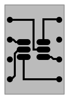
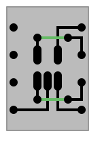
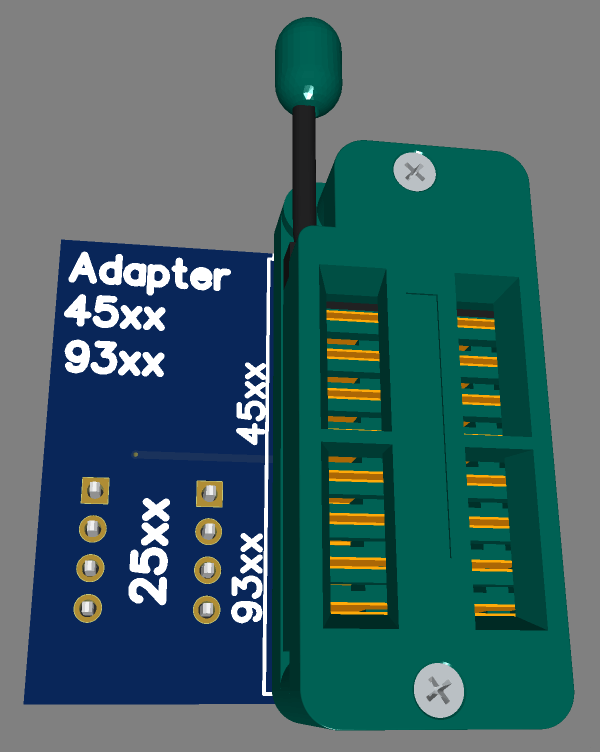
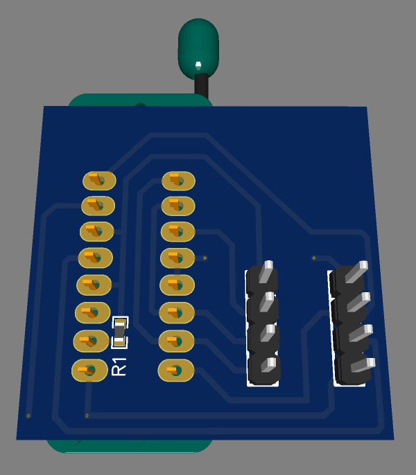
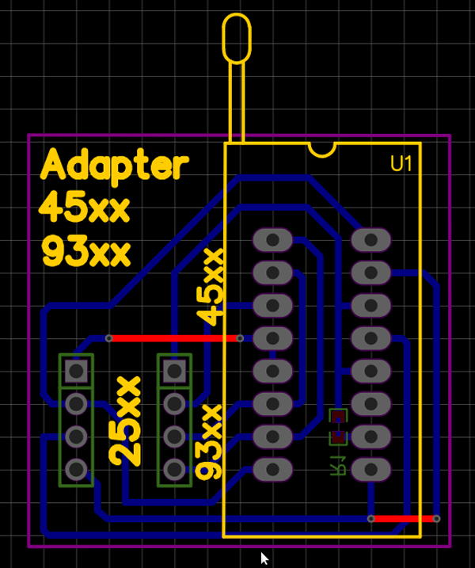

# Tools_for_CH341A_programmer

Homemade and factory tools for the CH341A programmer device.

* [3D-Printed housing for the programmer device](#3D-Printed-housing-for-the-programmer-device)
* [Homemade Chip adapters](#Homemade-Chip-adapters)
## 3D-Printed housing for the programmer device

The `FreeCad` files can be downloaded [here](3d_printing/CH341_black_up2.FCStd) (top half) and [here](3d_printing/CH341_black_down2.FCStd) (bottom half).

The `STL` files for the slicer can be downloaded [here](3d_printing/CH341_black_up2-Body.stl) (top half) and [here](3d_printing/CH341_black_down-Body.stl) (bottom half).

Two 9 mm long sections of used empty pen rod are used as light conducting elements for the SMD LEDs.

## Homemade Chip adapters

### The 93Cxx DIP-8 adapter

This adapter is used for 93C46, 93C56, 93C66, 93C76, 93C86 chips. It must be inserted into slot #25xxx# CH341 programmer device. 
The schematic of this adapter is:
 

The `KiCad` files can be download [here](kicad/93xxx_dip8_adapter.zip)

### The 93Cxx SOT-23-6 adapter

This adapter is used for 93C46, 93C56, 93C66, 93C76, 93C86 chips. It must be inserted into slot `25xxx` CH341 programmer device. 
The schematic of this adapter is:
 

The `KiCad` files can be download [here](kicad/93xxx_sot-23-6_adapter.zip)

### The 24Cxx SOT-23-5 adapter

This adapter is used for 24C01, 24C02, 24C04, 24C08, 24C16, 24C32, 24C64, 24C128, 24C256 chips. It must be inserted into slot `24xxx` CH341 programmer device. 
The schematic of this adapter is:
 

The `KiCad` files can be download [here](kicad/24Cxx_sot-23-5_adapter.zip)

### The 93Cxx DIP-8 adapter

This adapter is used for 93C46, 93C56, 93C66, 93C76, 93C86 DIP-8 case chips and AT45DP011, AT45DB021, AT45DB041, AT45DB081, AT45DB161, AT45DB321, AT45DB641 installed on the `SOP-8 - DIP-8 adapter`.
It must be inserted into slot #25xxx# CH341 programmer device. 
 

The `KiCad` files can be download [here](kicad/93_and_45_dip8_adapter.zip)

The `KiCad` files can be download [here](kicad/93xxx_dip8_adapter.zip)
