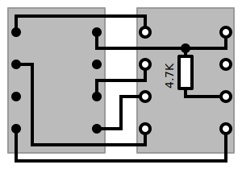
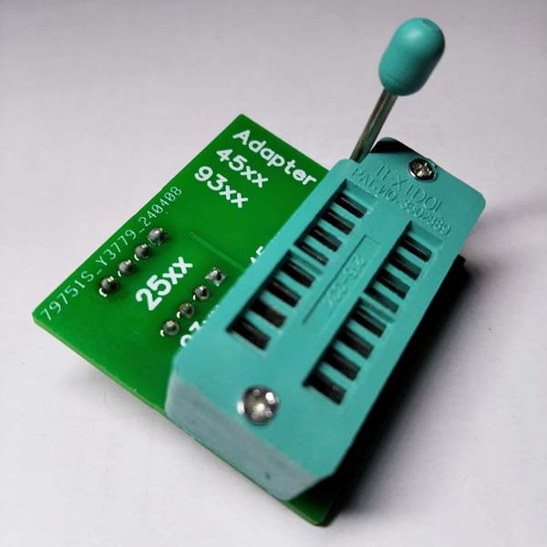
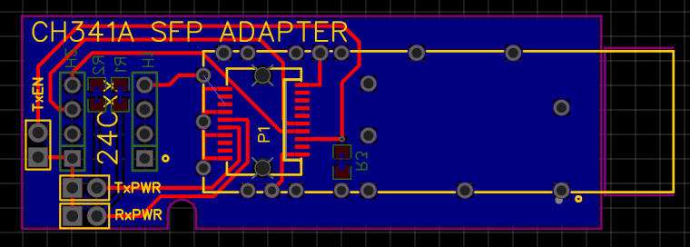
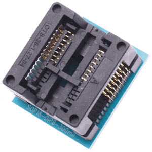

# Tools_for_CH341A_programmer

Homemade and factory tools for the CH341A programmer device.

* [3D-Printed housing for the programmer device](#3D-Printed-housing-for-the-programmer-device)
* [Homemade Chip adapters](#Homemade-Chip-adapters)
* [Factory-made adapters](#Factory-made-adapters)
## 3D-Printed housing for the programmer device

The `FreeCad` files can be downloaded [here](3d_printing/CH341_black_up2.FCStd) (top half) and [here](3d_printing/CH341_black_down2.FCStd) (bottom half).

The `STL` files for the slicer can be downloaded [here](3d_printing/CH341_black_up2-Body.stl) (top half) and [here](3d_printing/CH341_black_down-Body.stl) (bottom half).

Two 9 mm long sections of used empty pen rod are used as light conducting elements for the SMD LEDs.

## Homemade Chip adapters

### The 93Cxx DIP-8 adapter

This adapter is used for 93C46, 93C56, 93C66, 93C76, 93C86 chips. It must be inserted into slot `25xxx` CH341 programmer device. 
The schematic of this adapter is:
 

The `KiCad` files can be download [here](kicad/93xxx_dip8_adapter.zip)

### The 93Cxx SOT-23-6 adapter

This adapter is used for 93C46, 93C56, 93C66, 93C76, 93C86 chips. It must be inserted into slot `25xxx` CH341 programmer device. 
The schematic of this adapter is:
 

The `KiCad` files can be download [here](kicad/93xxx_sot-23-6_adapter.zip)

### The 24Cxx SOT-23-5 adapter

This adapter is used for 24C01, 24C02, 24C04, 24C08, 24C16, 24C32, 24C64, 24C128, 24C256 chips. It must be inserted into slot `24xxx` CH341 programmer device. 
The schematic of this adapter is:
 

The `KiCad` files can be download [here](kicad/24Cxx_sot-23-5_adapter.zip)

### The 93Cxx and 45xxx DIP-8 adapter

This adapter is used for 93C46, 93C56, 93C66, 93C76, 93C86 DIP-8 case chips and AT45DP011, AT45DB021, AT45DB041, AT45DB081, AT45DB161, AT45DB321, AT45DB641 installed on the `SOP-8 - DIP-8 adapter`.
It must be inserted into slot `25xxx` CH341 programmer device. 

 

The `KiCad` files can be download [here](kicad/93_and_45_dip8_adapter.zip)

The `EasyEDA` files can be download [here](EasyEDA/CH341A_93Cxx_45xxx_adapter_EasyEDA.zip)

The link to [OSHW Lab](https://oshwlab.com/einkreader/ch341a_93xxx_and_45xxx_adapter)

The `EasyEDA gerber` files can be download [here](EasyEDA/Gerber_CH341a_93xxx_and_45xxx_adapter.zip)

### Adapter for SFP-modules

This adapter is used to read and program SFP-module data. It must be inserted into the slot labelled `24xxx` of the CH341a programmer.

The schematic of this adapter is:

The `EasyEDA` page is [https://oshwlab.com/einkreader/ch341a_sfp_adapter](https://oshwlab.com/einkreader/ch341a_sfp_adapter).

## Factory-made adapters

| Type   |       Image          |  Link URL  | 
| :---   |       :---:          |     :---   |
| Socket DIP-8 - SOP-8 150mil |  | [link1](https://aliexpress.ru/item/32827349954.html) [link2](https://www.ebay.ie/itm/173491615389)|
| Socket DIP-8 - SOP-8 200mil |  | [link1](https://aliexpress.ru/item/32827349954.html) [link2](https://www.ebay.ie/itm/193379529969)|
| Socket DIP-8 - SOP-16 300mil |  | [link1](https://aliexpress.ru/item/32827349954.html) [link2](https://www.ebay.ie/itm/404297821827)|
| Socket DIP-8 - MSOP-8 |  | [link1](https://aliexpress.ru/item/32949689776.html)|
| Socket DIP-8 - WSON-8 |  | [link1](https://aliexpress.ru/item/1005007470583249.html) |
| Soldering DIP-8 - MSOP-8, SOP-8|  | [link1](https://aliexpress.ru/item/32855731928.html) [link2](https://www.ebay.ie/itm/115891728267)|

## Factory-made adapter-converter

This adapter used for converting the programmer voltage levels (0 / 3.3V) to 1.8 low level chips.

[link1](https://aliexpress.ru/item/4001360074235.html) [link2](https://www.ebay.ie/itm/253035788247)

